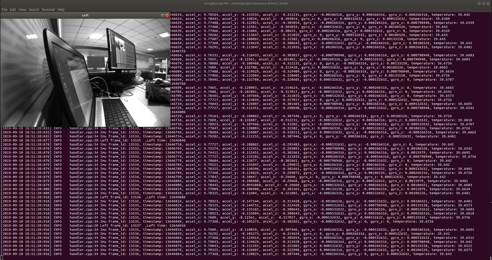

# camera-driver

## Generate libminiglog.so 
Note! Before run driver, run below commands in terminal to install miniglog at the first time:
```
cd miniglog
python build.py
```
## Compile and run

Modify $ProjectPath/CMakeLists.txt to choose use MYNT SDK or ROS.
```
option (ENABLE_MYNT_SDK "Enable MYNT SDK" ON)
option (ENABLE_MYNT_ROS "Enable MYNT ROS driver." OFF)

``` 

Then build project:
> 1. Methord 1
```
mkdir _build
cd _build
cmake ..
make
./driver_demo
```

> 2. Methord 2
```
./build.sh all
./_build/driver_demo

# `./build.sh all` equal to below steps:
# rm ./_build -rf
# mkdir _build
# cd _build
# cmake ..
# make
```

> 3. Methord 3
```
./build.sh
./_build/driver_demo

# `./build.sh` equal to below steps:
# cd _build
# make
```

> 4. Methord 4
```
./build.sh clean

# equal to below steps:
# cd _build
# make clean
```

## Results

效果:
